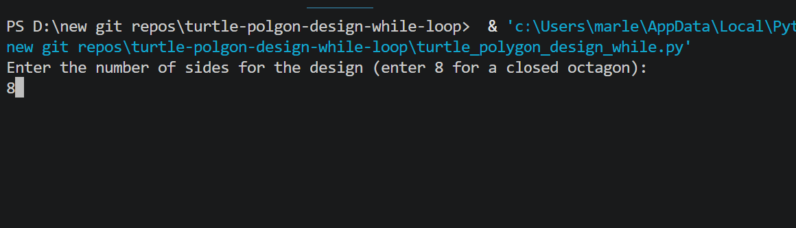
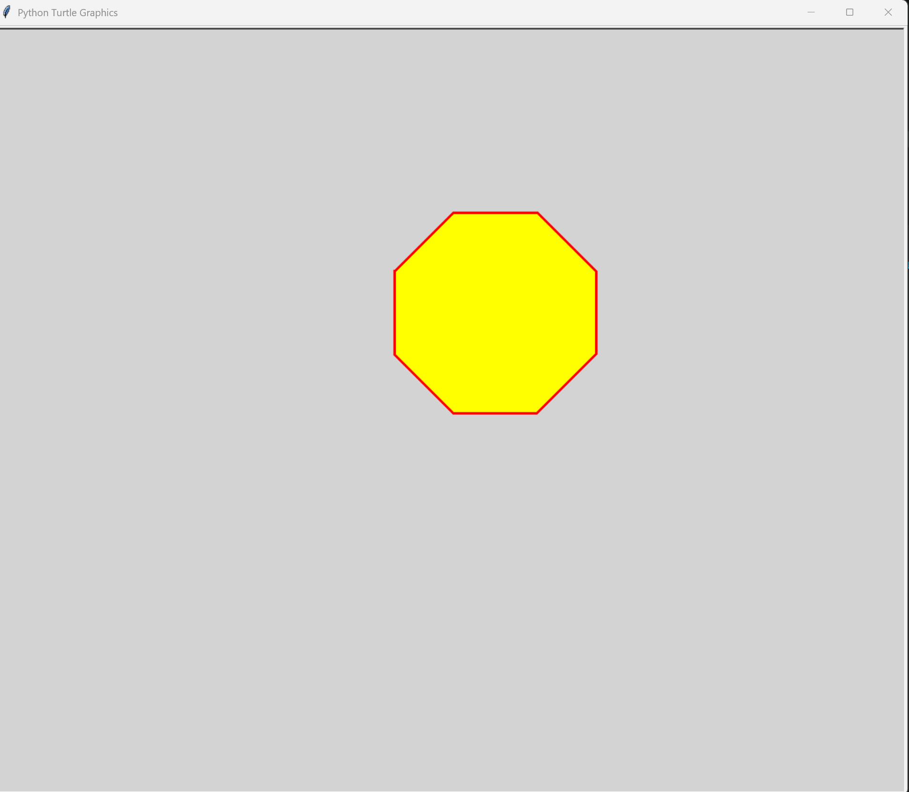

# 🔷 Turtle Graphics — Polygon Design (WHILE Loop)

A Python turtle graphics program that draws a customizable yellow filled polygon using a **WHILE loop**. The user enters the number of sides and the program draws each side one at a time.

---

## Features

- Draws a user-defined polygon (any number of sides)
- Yellow filled shape on a light gray canvas
- Uses a **WHILE loop** with a manual counter to draw each side
- Window stays open until the user closes it

---

## How It Works

1. User enters the number of sides
2. A `while` loop runs, drawing one side per iteration: move forward 100px, turn left 45°, increment counter
3. Shape is filled yellow when complete
4. Window stays open via `turtle.done()`

---

## Note on Shape Closing

The turtle turns **45° per side**. For a shape to close, total turning must equal 360°. This means the shape only fully closes at **8 sides** (8 × 45° = 360°, producing an octagon). Entering fewer sides produces an open/partial shape.

| Sides entered | Result |
|---|---|
| 4 | Open shape (half octagon) |
| 8 | Closed octagon ✅ |
| 16 | Two laps around the octagon |

---

## Screenshots

| Start | Finished |
|---|---|
|  |  |

---

## How This Differs From the Stop Sign Repos

| Feature | This repo | Stop Sign (WHILE) | Stop Sign (FOR) |
|---|---|---|---|
| Fill color | Yellow | Red | Red |
| Background | Light gray | Light green | Light green |
| Text | None | "STOP" in white | "STOP" in white |
| Pole | None | Yes | Yes |
| Loop type | WHILE | WHILE | FOR |

---

## Technologies Used

- Python 3
- `turtle` — Python's built-in graphics module
- `while` loop — manual counter control
- `fillcolor`, `begin_fill`, `end_fill` — shape filling
- `turtle.done()` — keeps window open after drawing

---

## Learning Outcomes

- WHILE loop syntax and loop control variables
- Basic turtle graphics shape drawing
- Understanding how fixed turn angles determine polygon closure
- Using `turtle.done()` to prevent window from closing

---

## How to Run

1. Make sure Python 3 is installed: https://www.python.org/downloads/
2. Clone or download this repo
3. Open a terminal in the repo folder
4. Run: `python turtle_polygon_design_while.py`
5. Enter **8** for a closed octagon, or any other number to experiment

---

## Folder Structure

```
turtle-polygon-design-while-loop/
├── turtle_polygon_design_while.py
├── start.png
├── finished.png
├── README.md
├── LICENSE
└── .gitignore
```

---

## License

This project is licensed under the MIT License — see the [LICENSE](LICENSE) file for details.

---

*Written by Marlena Fabrick — Computer Programming, Fall 2020*
